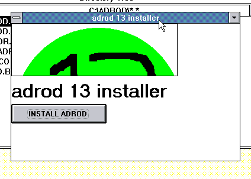

# adrod 13 installer (vb1)
This is a recreation of the adrod 13 installer Android
application in Visual Basic 1, so it's designed for Windows
3.0 and 3.1.

## How to exit
Type `Ctrl`+`Esc` then click on "End Task" on the program.
